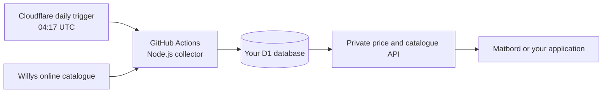

# Willys catalogue — $0 starting setup

A daily copy of one Willys online store's exposed catalogue, listed prices, conditional promotions and availability, stored in your own Cloudflare D1 database. A private API supplies the catalogue and fresh pack prices to Matbord or another application.

**Start with [SETUP.md](SETUP.md).** Run `npm install`, then `npm run connect`. The wizard creates the database, applies the schema, deploys the API, connects GitHub and installs the daily trigger after you supply your service credentials. It does not enable a paid subscription.

Setup saves each valid answer and checkpoints completed operations. After a failure, rerun the same command to continue where it stopped. Existing Cloudflare deployments made with the original wizard are recognized automatically. GitHub setup verifies and selects the repository owner's account before performing repository operations.

The live verification on 1 October 2026 collected **11,038 online products across 19 categories in about 23 minutes**, including listed prices and availability. A local database is already saved on this computer. See [verification](docs/verification.md) for the evidence and account-dependent checks.

## What runs where

The scheduled Worker dispatches the GitHub workflow directly. This avoids relying on GitHub's native scheduled-workflow activity requirement. The collector runs without installed runtime dependencies or AI calls; its pauses do not consume Worker CPU time. Standard GitHub-hosted runners in public repositories are free. Private repositories share the account's included Actions minutes. Free providers can change their plans; these are current allowances, not a promise of perpetual free hosting.

## Data and correctness

- Starts with the original client's default online context, **2110 — Willys Kungsbacka Hede**. This is an online assortment associated with a fulfilment store, not a verified nationwide physical-store catalogue. Change the ID before the first sync; use a separate database when changing stores after importing data.
- Uses the selected anonymous session and verifies the active online store before and after collection. Willys account credentials are not requested.
- Reads all currently valid top-level catalogue categories and every advertised page. Checks counts, duplicate pages and category-tree changes. The scope is all products exposed by those endpoints; hidden or uncategorized retailer items cannot be independently guaranteed.
- Deduplicates products, keeps out-of-stock online items, preserves raw responses and saves numeric money as integer öre. The raw listed price retains its `kr/st`, `kr/kg` or `kr/l` unit.
- Keeps complete current/previous snapshots. Uploads stage privately; a final pointer swap publishes the new catalogue. An interrupted upload cannot replace the last complete catalogue.
- Price history records observed changes to listed prices, source pricing fields and conditional offers. Stock changes update the catalogue without producing price-history rows. History defaults to 90 days with bounded cleanup; retention can temporarily exceed that during a cleanup backlog.
- A large unexpected drop stops publication. Verify the upstream change before explicitly running `npm run sync -- --allow-shrink`.
- The pack-price endpoint omits stale, unmapped or ambiguous prices. It does not apply conditional multi-buy or membership promotions as unconditional single-pack discounts. Promotional boundaries shorten validity conservatively.

## Commands

| Command | Purpose |
| --- | --- |
| `npm run connect` | Connect both services and deploy |
| `npm run connect:github` | Finish/reconnect the GitHub daily trigger |
| `npm run doctor` | Check settings, database, API and trigger-token access |
| `npm run stores` | List online store IDs during the crawler window |
| `npm run probe` | Check the selected store and one catalogue page |
| `npm run sync` | Collect and publish a full live catalogue |
| `npm run sync:preview` | Collect into ignored local JSON without a remote write |
| `npm run sync -- --local data/live-catalog.sqlite` | Collect into a local SQLite database |
| `npm run sync:fixture` | Exercise the pipeline with clearly marked test data locally |
| `npm run check` / `npm test` | Type checks and offline correctness tests |
| `npm run deploy` | Deploy the service after connection |

Live commands honor the current `robots.txt` instructions, with at least 10 seconds between requests and the default **04:00–08:45 UTC** window. Request/runtime/product limits stop the scan instead of silently truncating it. Do not increase load or bypass an access restriction when the retailer rejects requests. Confirm automated catalogue reuse with Willys for your intended use.

## Free limits and practical boundaries

The configuration caps a live scan at 300 retailer requests, 55 minutes and 20,000 products. GitHub bounds the whole job to 60 minutes. D1 collection stops around 80,000 recorded row writes for the run and 400 MB database size, leaving headroom under the current Free limits of 100,000 account-wide row writes/day and 500 MB/database. Index writes count; other account activity also counts. Those application caps are preventive estimates, while the provider's Free quota is the hard boundary.

The initial import and full fresh snapshots consume writes even when prices do not change. History contains changes only. Do not retain images, daily exports or GitHub artifacts in paid storage. The workflow uploads no artifacts. Add your own downloaded backups if required; D1 Free currently provides seven days of Time Travel recovery.

Daily refresh is a best-effort target. Network failures, expired tokens, quota exhaustion and changes to Willys' unofficial endpoints can leave the latest catalogue stale. The API exposes freshness and excludes prices older than 24 hours. A daily scan can miss a price that changes and reverses between scans; it is not an event stream of every retailer change.

See [API.md](docs/API.md), [upstream details](docs/upstream.md) and [verification](docs/verification.md).

## Official service references

- [GitHub Actions free allowances](https://docs.github.com/en/billing/concepts/product-billing/github-actions)
- [Cloudflare D1 pricing](https://developers.cloudflare.com/d1/platform/pricing/) and [limits](https://developers.cloudflare.com/d1/platform/limits/)
- [Cloudflare Cron Triggers](https://developers.cloudflare.com/workers/configuration/cron-triggers/)
- [GitHub workflow dispatch](https://docs.github.com/en/rest/actions/workflows#create-a-workflow-dispatch-event)
- [Willys crawler instructions](https://www.willys.se/robots.txt)
